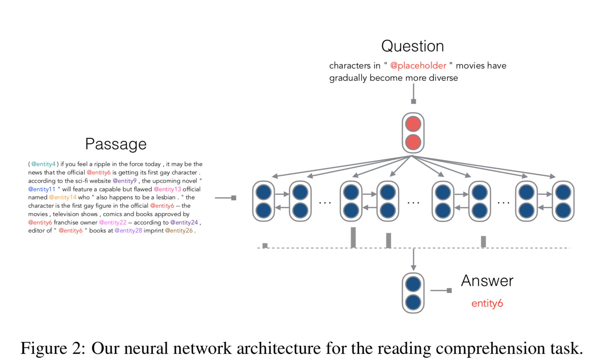

## [A Thorough Examination of the CNN/Daily Mail Reading Comprehension Task](https://arxiv.org/abs/1606.02858)
This paper using two models to do a through analysis of CNN/Daily Mail datasets. It reveals that:
- (1) this dataset is easier than previously realized
- (2) there exists significant noise in the dataset
- (3) current neural networks, like the one presented here, have essentially reached the performance ceiling on this dataset.
- Important notes: MRC systems are greatly helped by entity recognition.

### Models
#### Feature engineer for Entities Ranking
提取特征构建传统的分类器，这里其实是转换成了候选实体的ranking问题，即将ranking得分最高的实体作为答案。
1. Whether entity e occurs in the passage
2. Whether entity e occurs in the question
3. The frequency of entity e in the passage.
4. The first position of occurence of entity e in the passage.
5. n-gram exact match
6. Word distance
7. Sentence co-occurrence
8. Dependency parse match

#### End-to-end Neural Network
这里的神经网络模型主要是利用双向LSTM对passage和question分别进行encoding，并利用词与问题之间的相关性得到attention值，利用这个attention值对passage的embedding进行加权，得到一个最终的输出向量o，用于答案的预测。

