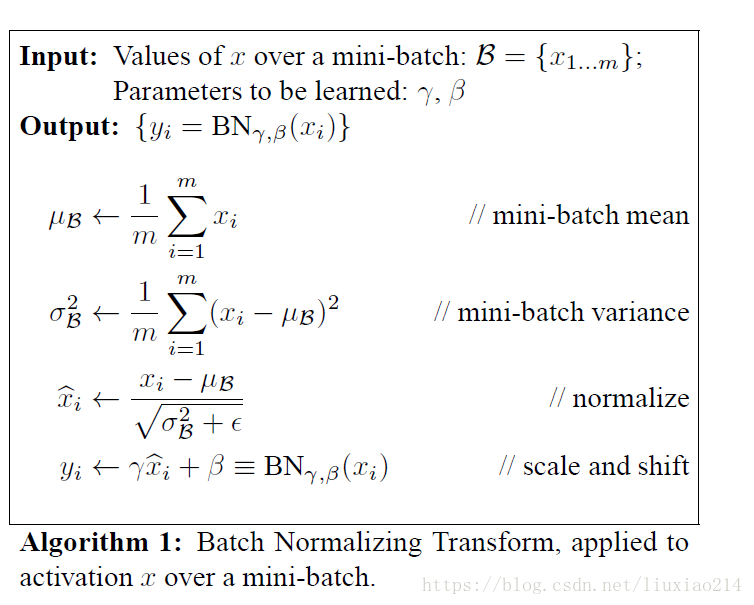

## [Batch Normalization in Deep Learning](https://zhuanlan.zhihu.com/p/43200897)
这篇文章从 Mini-Batch SGD 入手，分析如何计算梯度、BN 的原理、BN 存在的问题以及目前的解决方案。
### Mini-Batch SGD

Batch Size的影响:
- batch size 设置得较小训练出来的模型泛化能力更强，在测试集上的表现更好;
- 而太大的batch size往往不太Work，而且泛化能力较差.

### Batch Norm
Normalization 将神经网络的输出规范化，一般有两种形式：

- 第一种是原始BN论文提出的，放在激活函数之前；另外一种是后续研究提出的，放在激活函数之后，不少研究表明 *将BN放在激活函数之后效果更好*。

**BN 计算方法：**

### Batch Norm 的缺陷
1. BN是严重依赖Mini-Batch中的训练实例的，如果Batch Size比较小则任务效果有明显的下降。BN 无法应用在Online Learning中；
2. 对于有些像素级图片生成任务来说，BN效果不佳，很可能是因为在Mini-Batch内多张无关的图片之间计算统计量，弱化了单张图片本身特有的一些细节信息；
3. RNN 等动态网络使用BN效果不佳且使用起来不方便，因为 RNN 输入的文本长度（时间维度）不一，时间维度计算的统计量不准确；
4. 训练时和预测时统计量不一致，训练阶段计算的 batch 的样本的统计量和实际预测的样本分布不一致。

其核心原因是：**BN要求计算统计量的时候必须在同一个Mini-Batch内的实例之间进行统计，因此形成了Batch内实例之间的相互依赖和影响的关系。**

### Batch Norm 的改进
改进的思路是摆脱 Batch 的依赖，能够在只有当前一个训练实例的情形下，也能找到一个合理的统计范围。
#### Layer Normalization
- MLP的同一隐层包含了若干神经元；同理，CNN中同一个卷积层包含k个输出通道，每个通道包含m*n个神经元，整个通道包含了k*m*n个神经元；类似的，RNN的每个时间步的隐层也包含了若干神经元。
- Layer Normalization 的思想是直接用同层隐层神经元的响应值作为集合S的范围来求均值和方差。
如 RNN 中：

注：**Layer Normalization 常用在 RNN 中，在 MLP 和 CNN 中效果较差。**

#### Instance Normalization
CNN 中将同一个卷积层内每个卷积核会产生一个输出通道，每个输出通道是一个二维平面，在同层内所有神经元的响应值作为统计范围。

- Instance Normalization对于一些图片生成类的任务比如图片风格转换来说效果是明显优于 BN 的，但在很多其它图像类任务比如分类等场景效果不如 BN。

#### Group Normalization
Layer Normalization和Instance Normalization可以看出，这是两种极端情况，Layer Normalization是将同层所有神经元作为统计范围，而Instance Normalization则是CNN中将同一卷积层中每个卷积核对应的输出通道单独作为自己的统计范围。通道分组是CNN常用的模型优化技巧，所以自然而然会想到对CNN中某一层卷积层的输出或者输入通道进行分组，在分组范围内进行统计。这就是Group Normalization的核心思想，是Facebook何凯明研究组2017年提出的改进模型。

- Group Normalization在要求Batch Size比较小的场景下或者物体检测／视频分类等应用场景下效果是优于BN的。

### Batch Normalization 有效的本质原因
BN 的有效本质上并不是减小 ICS（Internal Covariate Shift），BN真正的用处在于：**通过上文所述的 Normalization 操作，使得网络参数重整（Reparametrize），它对于非线性非凸问题复杂的损失曲面有很好的平滑作用，参数重整后的损失曲面比未重整前的参数损失曲面平滑许多。**（L-Lipschitz函数来评估损失曲面的平滑程度）

- BN通过参数重整起到了平滑损失曲面及梯度的作用。

### 总结
不同 Normalization 将神经元的激活值重整为均值为0方差为1的新数值，最大的不同在于计算统计量的神经元集合S的划分方法上：
- BN采用了同一个神经元，但是来自于Mini-Batch中不同训练实例导致的不同激活作为统计范围；
- 为了克服Mini-Batch带来的弊端，后续改进方法抛弃了 Mini-Batch 的思路，只用当前训练实例引发的激活来划分集合S的统计范围：
  - LayerNorm采用同隐层的所有神经元；
  - InstanceNorm采用 CNN 中卷积层的单个通道作为统计范围；
  - GroupNorm则折衷两者，采用卷积层的通道分组，在划分为同一个分组的通道内来作为通道范围。

使用场景：
- 对于 RNN 的神经网络结构来说，目前只有LayerNorm是相对有效的；
- 如果是 GAN 等图片生成或图片内容改写类型的任务，可以优先尝试 InstanceNorm；
- 如果使用场景约束 BatchSize 必须设置很小，无疑此时考虑使用GroupNorm；
- 而其它任务情形应该优先考虑使用 BatchNorm。
