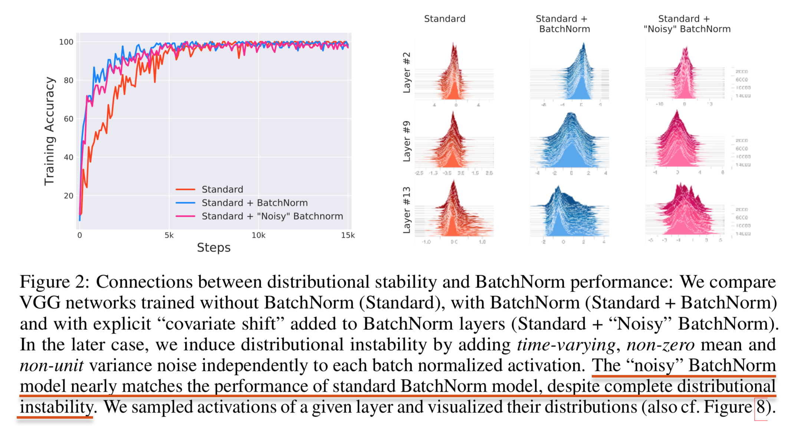
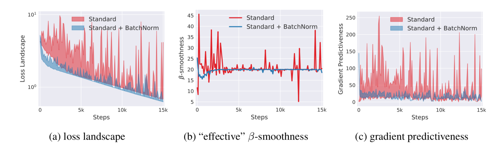

## [How Does Batch Normalization Help Optimization?](https://arxiv.org/pdf/1805.11604.pdf)
This paper provide two contributions:
- BatchNorm might not even be reducing internal convariate shift.
- The true roots of BatchNorm’s success. **BatchNorm makes the landscape of the corresponding optimization problem be significantly more smooth.** This ensures, in particular, that the gradients are more predictive and thus allow for use of larger range of learning rates and faster network convergence.

### BatchNorm’s performance doen't stem from controlling internal covariate shift.

**Experiment**: *measure the difference between the gradients of each layer before and after updates to all the previous layers.*
- The difference between G and G′ thus reflects the change in the optimization landscape of `Wi` caused by the changes to its input.
- Surprisingly, we observe that networks with BatchNorm often exhibit an increase in ICS.
- This evidence suggests that, from optimization point of view, controlling the distributions layer inputs as done in BatchNorm, might not even reduce the internal covariate shift.

### Why does BatchNorm work?

The key implication of BatchNorm’s reparametrization is that it **makes the gradients more reliable and predictive.**

Improved Lipschitzness of the gradients **gives us confidence that when we take a larger step in a direction of a computed gradient, this gradient direction remains a fairly accurate estimate of the actual gradient direction after taking that step.** It thus enables any (gradient–based) training algorithm to take larger steps without the danger of running into a sudden change of the loss landscape such as flat region (corresponding to vanishing gradient) or sharp local minimum (causing exploding gradients). This, in turn, **enables us to use a broader range of (and thus larger) learning rates and, in general, makes the training significantly faster and less sensitive to hyperparameter choices.**
