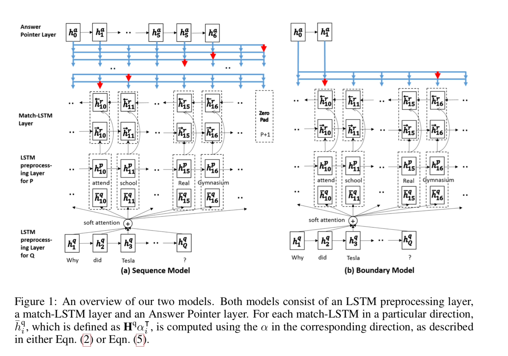
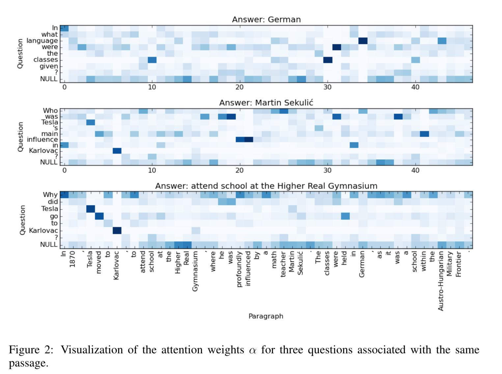

## [Machine Comprehension Using Match-LSTM and Answer Pointer](https://arxiv.org/abs/1608.07905)
This paper proposed an end-to-end neural architecture for SQuAD dataset.The architecture is based on **match-LSTM, for textual entailment(NLI, natural language inference)**, and **Pointer Net, a seq-to-seq model to constrain the output tokens to be from the input sequences.** They proposed two ways of using Pointer Net, **Sequence answer layer and Boundary answer layer.**

### Model

##### 1. LSTM Preprocessing Layer
- incorporate contextual information into the representation of each token in the passage and the question.

##### 2. Match-LSTM Layer
- treating the question as a premise and the passage as a hypothesis.

##### 3. Answer Pointer Layer
- Recall the Pointer-Net ignore the fact that these tokens are consecutive in the original passage.
- The Sequence Model: the answer is represented by a sequence of integers a = (a1 , a2 , . . .) indicating the positions of the selected tokens in the original passage.
- The Boundary Model: works in a way very similar to the sequence model above, except that instead of predicting a sequence of indices a1 , a2 , . . ., we only need to predict two indices as and ae.

#### Result

