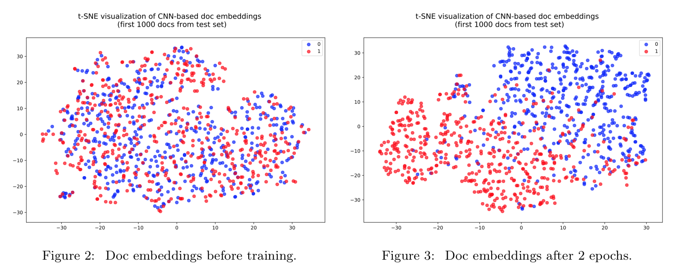
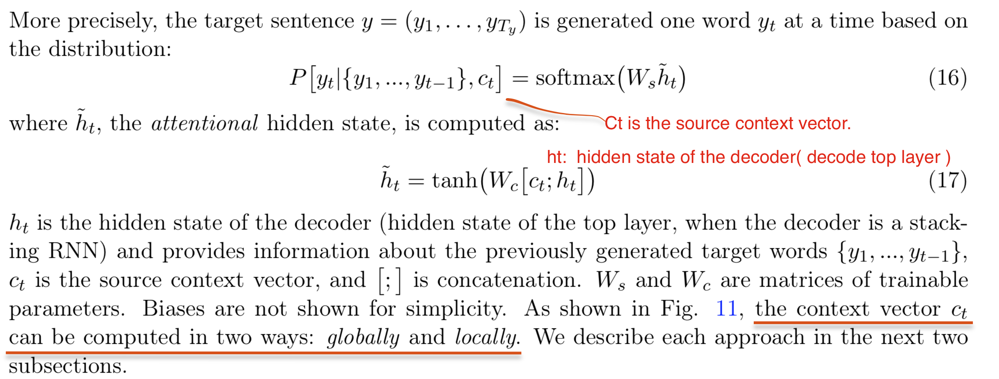
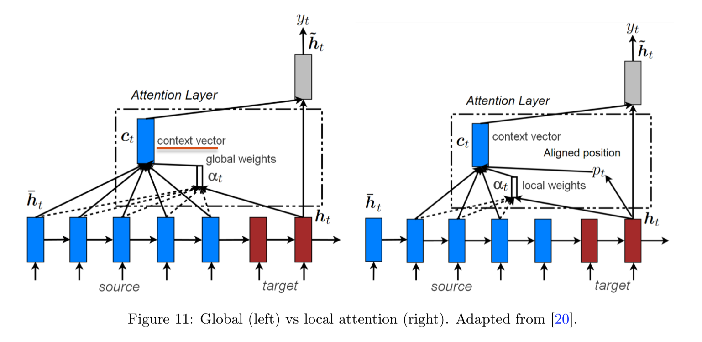
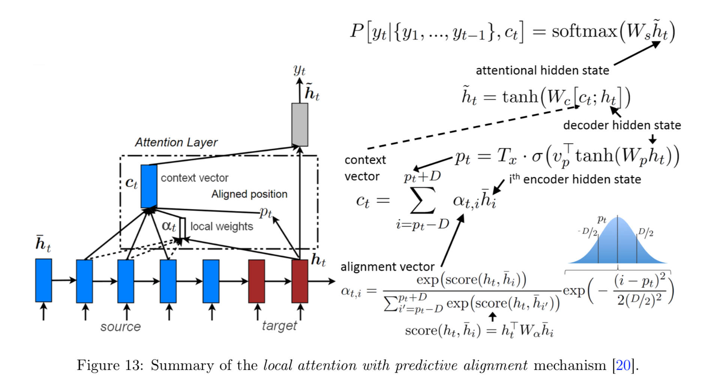
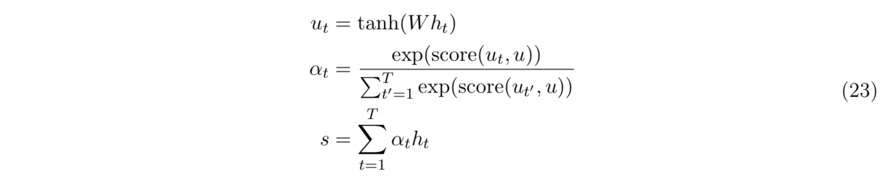

## [Notes on Deep Learning for NLP](https://arxiv.org/pdf/1808.09772.pdf)
这篇论文回顾了深度学习在 NLP 领域的常用技术：Document Embedding、RNN、Seq2Seq、Attention。

### Visualizing inner representations
A fast and easy way to verify that our model is learning effectively is to check whether its internal document representations make sense. Use t-SNE to project the vectors to a low-dimensional map.

### Seq2Seq

#### Global attention
The context vector ct is computed as a weighted sum of the full list of annotations `hi` of the source sentence.

- `αt` is a probability distribution over all source hidden states, and indicates which words in the source sentence are the most likely to help in predicting the next word.
- `score()` can in theory be any comparison function. They found that dot works better for global attention while general is superior for local attention.
#### Local attention
- Considering all words in the source sentence to generate every single target word is expensive, and may not be necessary.

- `Tx` is the length of the source sentence.
- `pt` is the position where to center the window is.
- The addition of the Gaussian term makes the alignment weights decay as i moves away from the center of the window pt, i.e., it gives more importance to the annotations near pt.
#### Self-attention
An alignment coefficient `αt` is then derived by comparing the output `ut` of the dense layer with a trainable **context vector** `u` (initialized randomly) and normalizing with a softmax. The attentional vector s is finally obtained as a weighted sum of the annotations.

- *The context vector can be interpreted as a representation of the optimal word, on average.*
- the alignment vector `α` indicates *the similarity of each input word with respect to the optimal word (on average)*, *while in seq2seq attention, `α` indicates the relevance of each source word in generating the next element of the target sentence.*
