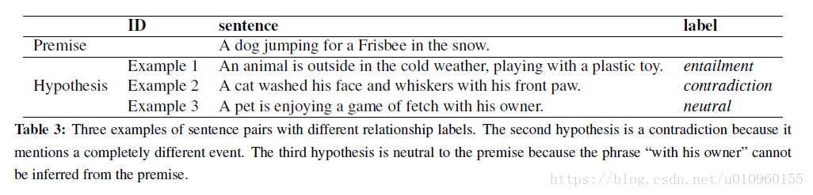
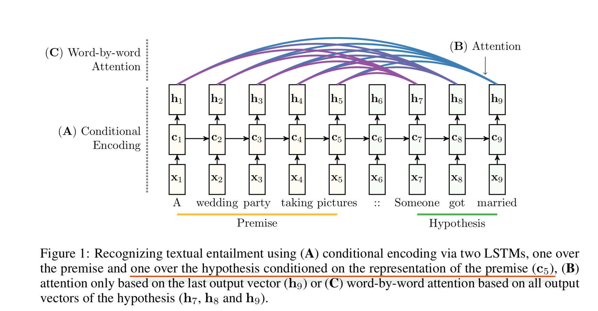
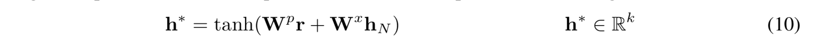

## [Reasoning about Entailment with Neural Attention](https://arxiv.org/abs/1509.06664)

### RTE task
Recognizing textual entailment (RTE) is the task of determining whether two natural language sentences are:
- contradicting each other（相互矛盾，冲突）
- not related （不相关的，中立的）
- the first sentence (called premise) entails the second sentence (called hypothesis). （蕴含关系）

这个例子中前提P是“A dog jumping for a Frisbee in the snow”，意思一只狗在雪地中接飞盘玩，同时下面给出了三个假设，这三个假设中前提跟第一个是蕴含关系（entailment），因为这句话描述的是“一个动物正在寒冷室外玩塑料玩具”，这是能够从前提推理出来的；第二句化描述的是“一只猫...”，这跟前提是冲突的（contradiction）；第三句话与前提既不是蕴含关系也没有冲突，我们把它定义成中立的（neutral）。

- 文本蕴含识别（Recognizing Textual Entailment，RTE）主要目标是对前提和假设进行判断，判断其是否具有蕴含关系。文本蕴含识别形式上是一个文本分类的问题，在上面这个例子中是一个三分类的问题，label分别为entailment，contradiction，neutral。

#### Model

- 左边的 premise 使用 LSTM 读取。第二个拥有不同参数的 LSTM 读取分隔符和 hypothesis，但它的记忆状态是使用前面的 LSTM 最后的 cell state，两个 LSTM 串行连接的（seq2seq model）；
- 第二个 LSTM 按词处理 hypothesis 时注意第一个 LSTM 关于 premise 的输出向量，所以 对hypothesis中的每个词 x_t 在所有 premise 的输出向量上产生注意力权重 alpha_t；
- The final sentence-pair representation is obtained from a non-linear combination of the attention- weighted representation r of the premise and the last output vector hN using

