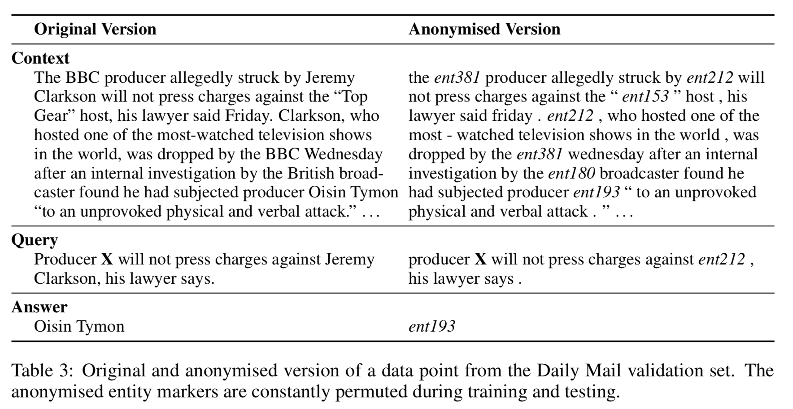
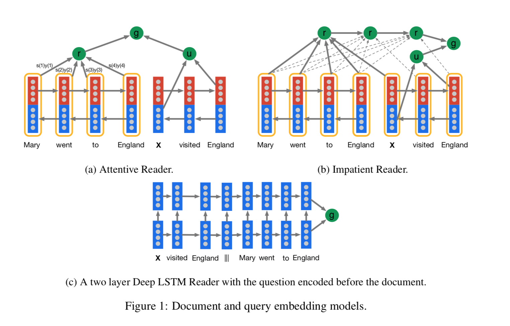

# [Teaching Machines to Read and Comprehend](https://arxiv.org/abs/1506.03340)
This paper produce large scale MRC dataset CNN and Daily Mail, using Entity replacement and permutation.
And experiments some Neural Network model as benchmarks.

## Dataset

## Models

- **The Deep LSTM Reader**: processes each document query pair as a single long sequence(concate). Given the embedded document and query the network predicts which token in the document answers the query.
- **The Attentive Reader**: The Attentive Reader employs a finer grained(细粒度) token level attention mechanism where the tokens are embedded given their entire future and past context in the input document.
- **Impatient Reader**: Attention mechanism that allows the model to recurrently accumulate information from the document as it sees each query token, ultimately outputting a final joint document query representation for the answer prediction.
