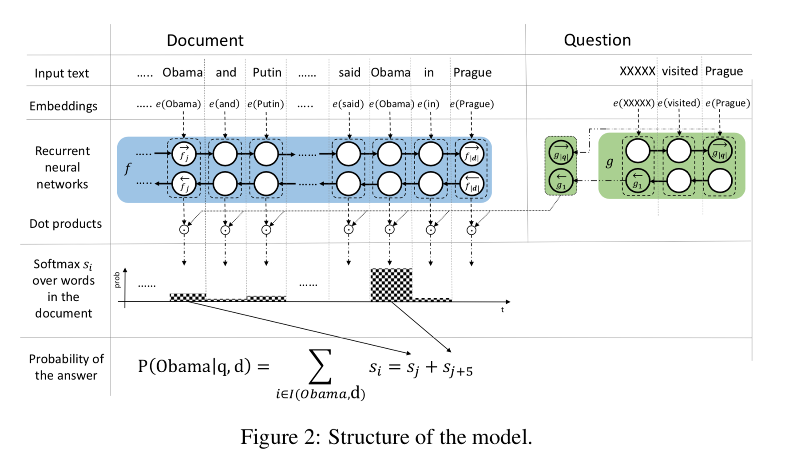

# [Text Understanding with the Attention Sum Reader Network](https://arxiv.org/abs/1603.01547)
This paper focus on Cloze style question, present a new, simple model that uses attention to directly pick the answer from the context.

## Model

- Compute a vector embedding of the query(BiGRU).
- Compute a vector embedding of each individual word in the context of the whole document(contextual embedding)(BiGRU).
- Compute a weight for every word in the document as the dot product of its contextual embedding and the query embedding.
- Normalize the weights using the softmax function. This way we model probability `si` that the answer to query `q` appears at position `i` in the document d.
- Use attention as a pointer over discrete tokens in the context document and directly sum the word’s attention across all the occurrences.
