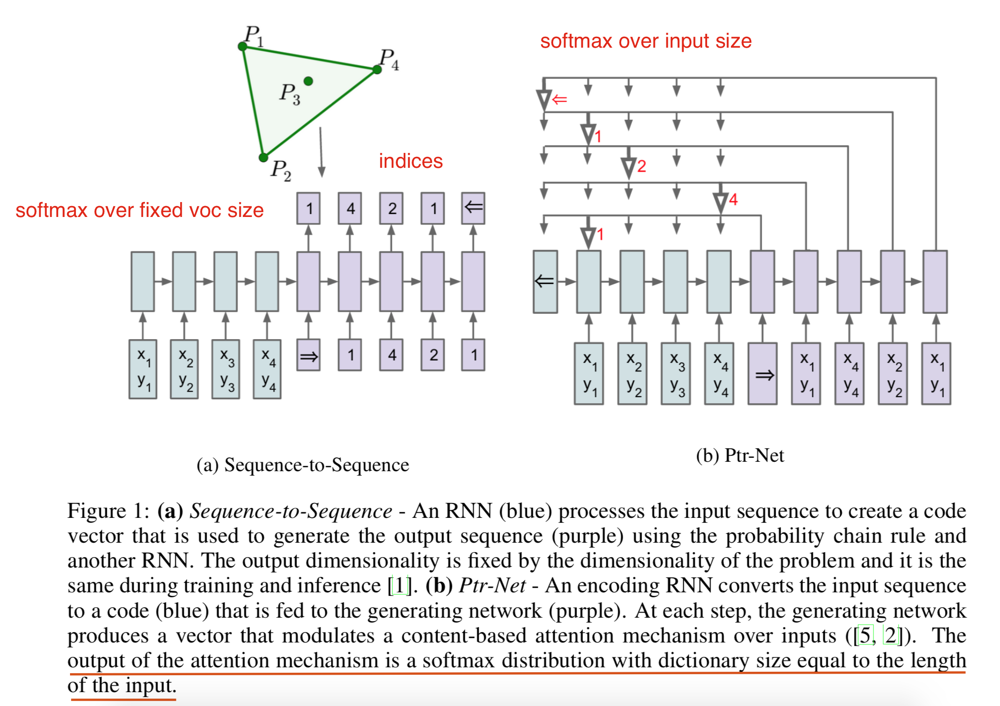
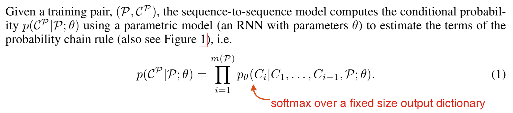
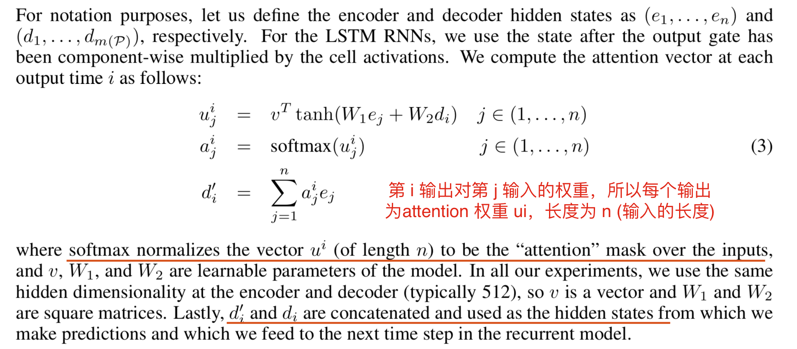
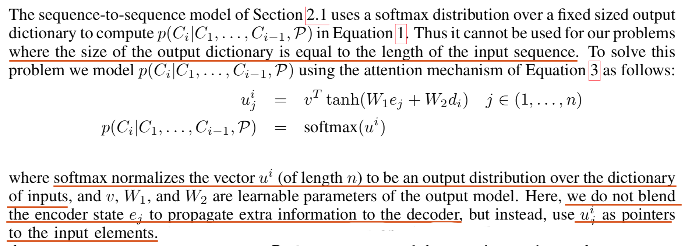

## [Pointer Networks](http://arxiv.org/abs/1506.03134)
This paper proposed a new architecture, Pointer Net, which is simple and effective. It deals with the fundamental problem of representing variable length dictionaries by using a softmax probability distribution as a “pointer”.

#### Key Points
- A Pointer Network is a seq2seq architecture with attention mechanism where the output vocabulary is the set of input indices.
- Pointer Net deals with the fundamental problem of representing variable length dictionaries by using a softmax probability distribution as a “pointer”.
- Similar to standard seq2seq model, instead of using attention to blend hidden units of an encoder to a context vector at each decoder step, Pointer Net uses attention as a pointer to select a member of the input sequence as the output.

#### Model Architecture

##### Sequence-to-Sequence Model

##### Content Based Input Attention

##### Poniter Networks

#### Notes / Questions
- Pointer Net is applied to machine reading comprehension, where output size is 2, select start position and end position.
- This architecture could be applied to generating spans, maybe using in POS tagging?
